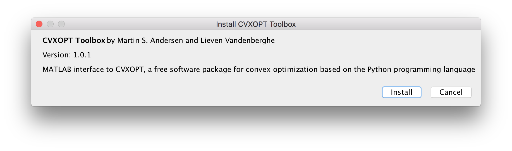

# CVXOPT Toolbox — a MATLAB interface to CVXOPT
This MATLAB toolbox provides an interface to CVXOPT's [cone LP](http://cvxopt.org/userguide/coneprog.html?#linear-cone-programs) solver.

CVXOPT website: [http://cvxopt.org](http://cvxopt.org)

## License
CVXOPT license: GPL 3

Toolbox license: BSD 3-Clause

### Requirements
- Supported platforms: macOS, Linux
- MATLAB R2014b or later
- Python environment with [CVXOPT](https://github.com/cvxopt/cvxopt) 1.1.9 or later

The version of the Python interpreter used by MATLAB can be changed with the [`pyversion`](http://www.mathworks.com/help/matlab/ref/pyversion.html) function.

### Known bugs
The Linux version of MATLAB may crash when calling the toolbox function `conelp` because of a library conflict: MATLAB's MKL library is used in place of the BLAS library that CVXOPT otherwise uses when loaded in Python, causing a segmentation fault. This issue is similar to the library conflict reported in [this thread](https://www.mathworks.com/matlabcentral/answers/265247-importing-custom-python-module-fails) on MATLAB Answers, and the same workarounds seem to work. In particular, by executing `py.sys.setdlopenflags(int32(10))` before Python is loaded, the library conflict is avoided. The toolbox includes a script that will do this if the platform is Linux:

```matlab
>> cvxopt_init
```

This script should be executed *before* Python is loaded (see [`pyversion`](http://www.mathworks.com/help/matlab/ref/pyversion.html)).

## Installation

### Method 1: Add-On Explorer (MATLAB R2015b or later)
On MATLAB’s Home tab, click on "Add-Ons" and select “Get Add-Ons”. This will open the Add-On Explorer. Search for "CVXOPT Toolbox" and click on "Add".

### Method 2: Manual Installation
Double-click on `CVXOPT Toolbox.mltbx` and click on the "Install" button.




### Method 3: Terminal (MATLAB R2016a or later)

```
git clone https://github.com/cvxopt/cvxopt-matlab
cd cvxopt-matlab
make install
```

If MATLAB is not available in the path, set `MATLAB_ROOT` to the root directory of your MATLAB installation (the appropriate path can be found with MATLAB's `matlabroot` function), i.e.,

```
MATLAB_ROOT=/path/to/matlabroot make install
```

### Uninstalling the toolbox
On MATLAB’s Home tab, click on "Add-Ons" and select "Manage Add-Ons". Locate the CVXOPT Toolbox and select "Uninstall..." from the drop-down menu.


## Test
To check that the toolbox has been properly installed and is working, run the `cvxopt_test` script:

```matlab
>> cvxopt_test
```

## Documentation

### Getting Started Guide (requires MATLAB R2016a or later)
On MATLAB’s Home tab, click on "Add-Ons" and select "Manage Add-Ons". Locate the CVXOPT Toolbox and select "View Getting Started Guide" from the drop-down menu. Alternatively, open the MATLAB Live Script located in `doc/Getting Started Guide.mlx`.

### Solving cone linear programs with `conelp`

The `conelp` function  

```
sol = conelp(c,G,h,dims,A,b,options);  
```

solves a cone linear program. Basic information about how to use the `conelp` function is included in the help text:

```matlab
>> help conelp
```
Some examples of how to use `conelp` are included in the `examples` directory.

### CVXOPT userguide

For more information about how to use CVXOPT and additional examples, see the [userguide](http://cvxopt.org/userguide/).
